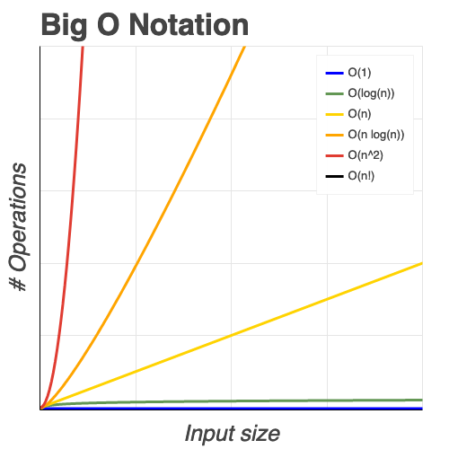
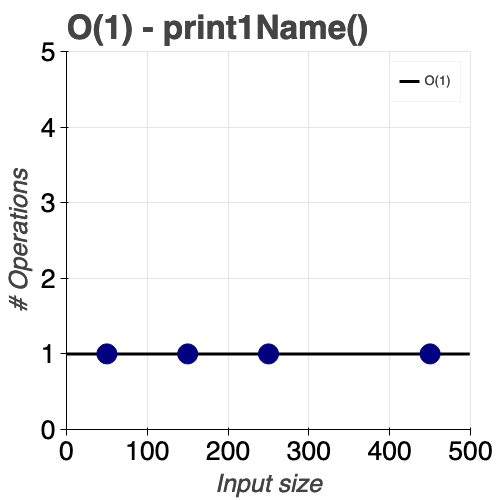
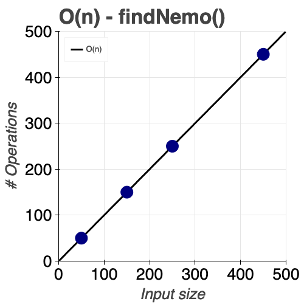
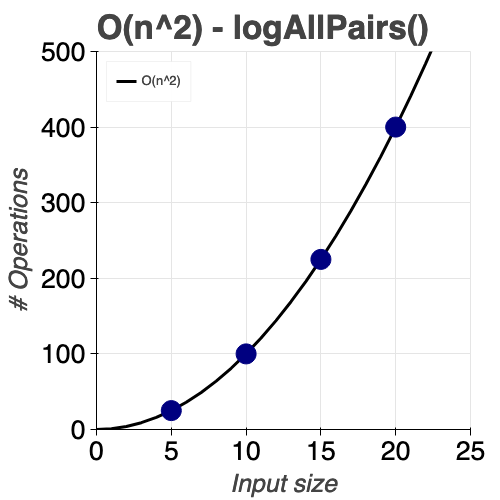

# Big O <!-- omit in toc -->

- [What is good code ?](#what-is-good-code-)
- [How can we measure the efficiency of this code?](#how-can-we-measure-the-efficiency-of-this-code)
- [O(1) - Constant](#o1---constant)
- [O(n) - Linear](#on---linear)
- [O(n^2) - Quadratic](#on2---quadratic)
- [O(n!) - Factorial or... Oh no !](#on---factorial-or-oh-no-)
- [Simplifying Big O](#simplifying-big-o)
  - [Rule 1: Worst Case](#rule-1-worst-case)
  - [Rule 2: Remove Constants](#rule-2-remove-constants)
  - [Rule 3: Different terms for inputs](#rule-3-different-terms-for-inputs)
  - [Rule 4: Drop Non Dominants](#rule-4-drop-non-dominants)
- [Exercises](#exercises)
  - [Big O Calculation - Exercise 1](#big-o-calculation---exercise-1)
  - [Big O Calculation - Exercise 2](#big-o-calculation---exercise-2)

Big O analysis is extremely important! It tells how well a problem is solved in terms of time... Time complexity.

Big O will come up on every section of the course.

**Example:**

Function: `findNemo` function on `code.py` file

1. How long is this function taking to run with array `nemo`
1. How long is this function taking to run with array `everyone`
2. How long is this function taking to run with array `array_1000`
2. How long is this function taking to run with array `array_1000000`

The runtime of this algorithm increases as we use more data.

> **Runtime:**
Time to run a certain problem through a function or task

## How can we measure the efficiency of this code? 

The speed at which any code runs, depends on many factors such as the CPU, the programs running in the background, etc. So just measuring the time it takes to run the function, doesn't actually tells us how efficient the algorithm is. 

For example, if we have CPU 1 which is twice as fast as CPU 2, and it takes this algorithm less time to run in CPU 1, it means the CPU is more powerful, not that the algorithm magically becomes less efficient when run with CPU 2.

This is why we need to ask ourselves...

**As the input grow bigger and bigger, how many more operations do we have to do ?**

The Big O notation can be read like:

- O(n): With n inputs, we get n operations
- O(n^2): With n inputs, we get n^2 operations
- Etc.

This gives us an idea of how scalable a function is, because we can have an algorith taking miliseconds running, but when we run that same function with a bigger input, it can suddenly take a year to run (which is obviously not an optimal time).

<p align="center">

</p>

*Plot made with Bokeh on file `plots.py`. (bigOPlot)*

## O(1) - Constant

Function: `print1Name` on `code.py` file

How much this function's runtime grow as the input increases?
1. If we had an array with 1 name, it is gonna run the whole function 1 time.  
2. If we had an array with 10 names, it is gonna run the whole function 1 time. 
3. If we had an array with 1000 names, it is gonna run the whole function 1 time. 
4. If we had an array with 1000000 names, it is gonna run the whole function 1 time. 
 
If we plot those values with y-axis "# Operations" and x-axis "input size", we are gonna come up with a constant function:

<p align="center">

</p>

*Plot made with Bokeh on file `plots.py`. (bigO1Plot)*

CONCLUSION: This function's runtime doesn't grow as the input increases.

## O(n) - Linear

**EXAMPLE:**  

Function: `findNemo` on `code.py` file

How much this function's runtime grow as the input increases?
1. If we had an array with 50 names, it is gonna run the whole function 50 times. 
2. If we had an array with 150 names, it is gonna run the whole function 150 times. 
3. If we had an array with 250 names, it is gonna run the whole function 250 times. 
4. If we had an array with 450 names, it is gonna run the whole function 450 times. 

If we plot those values with y-axis "# Operations" and x-axis "input size", we are gonna come up with a linear function:

<p align="center">

</p>

*Plot made with Bokeh on file `plots.py`. (bigOnPlot)*

CONCLUSION: This function's runtime grows linearly as the input increases.

## O(n^2) - Quadratic

Function: `logAllPairs` on `code.py` file

How much this function's runtime grow as the input increases?
1. If we had an array with 5 items, it is gonna run the whole function 25 times. 
2. If we had an array with 10 items, it is gonna run the whole function 100 times. 
3. If we had an array with 15 items, it is gonna run the whole function 225 times. 
4. If we had an array with 20 items, it is gonna run the whole function 400 times. 

If we plot those values with y-axis "# Operations" and x-axis "input size", we are gonna come up with a quadratic function:

<p align="center">

</p>

*Plot made with Bokeh on file `plots.py`. (bigOn2Plot)*

CONCLUSION: This function's runtime has a quadratic growth as the input increases.

**NOTE:** When there are nested loops, usually the complexity is `O(n^2)`, because for each iteration of the outer loop, the inner loop runs completely. It basically means the complexity now becomes `n*n` which is `n^2`.

The function above, runs 3 lines of code at first, then a loop n times, and each of the times it loops, it runs 3 lines. Then it runs another loop n times and each iteration executes 2 lines of code. Finally, at the end it runs one las line of code. To put that mathematically, it makes `4+5n` operations for an input `n` long.


## O(n!) - Factorial or... Oh no !

Usually when something has this level of complexity... something is wrong

Factorial means: `x! = x*(x-1)(x-2)...(1)`, and in programming terms, it means we're adding a nested loop for every input that we have.

## Simplifying Big O
We can define 4 rules to define Big O consistently faster

### Rule 1: Worst Case
We always need to think about the worst case. In the `findNemo()` function, we are looping through the entire array to find Nemo. In an ideal case, we can stop the function once Nemo is found, but we have to assume the worst case scenario, that being... Nemo being at the very end of the array.

### Rule 2: Remove Constants
Constants are usually irrelevant when scaling, so if we have any constant, we can assume the complexity as `O(1)`. 

If a constant is next to another term, we can ignore it, such as in `3n` becoming `O(n)`. This is because when scaling the function, again, the constant is not gonna make a relevant change un the function's runtime.

### Rule 3: Different terms for inputs
TRICKY !

```javascript
function compressBoxesTwice(boxes, boxes2) {
  boxes.forEach(function(boxes) {
    console.log(boxes);
  });

  boxes2.forEach(function(boxes2) {
    console.log(boxes2);
  });
}
```

There are sometimes multiple loops going around multiple inputs. For example, the function below loops through both inputs. In this cases, the complexity is not O(2n), it is O(n+m).

"Just because you see multiple for loops in a single function, it doesn't mean they are looping over the same items".

### Rule 4: Drop Non Dominants
We just need to find the faster scaling term within the function that defines the number of operations per input. For example, if we have `3n+7`, `3n` scales faster than 7, so we can just take the first term. 

If we have a function which complexity is `O(n^2 + 4n + 10000)`, as we said before, we can drop the constant as in [Rule 2](#rule-2-remove-constants), but later, we got two different terms... `n^2` and `4n`. Following the same logic when we ignored constnats, `n^2` scales way faster than `4n`, so we call it **The dominant term**.

Finally, we just need to keep into our notation the dominant term. `O(n^2 + 4n + 10000)` becomes `O(n^2)`.

[CHEAT SHEET](cheatSheet.md)

## Exercises

### Big O Calculation - Exercise 1

What is the Big O of the below function? (Hint, you may want to go line by line)

```javascript
function funChallenge(input) {
  let a = 10;
  a = 50 + 3;

  for (let i = 0; i < input.length; i++) {
    anotherFunction();
    let stranger = true;
    a++;
  }
  return a;
}
```
The function above, runs 2 lines of code at first, then a loop n times, and each of the times it loops, it runs 3 lines. Finally, at the end it returns something. To put that mathematically, it makes `2+3n+1` or `3+3n` operations for an input `n` long, which means it has a complexity `O(n)`

### Big O Calculation - Exercise 2

What is the Big O of the below function? (Hint, you may want to go line by line)

```javascript
function anotherFunChallenge(input) {
  let a = 5;
  let b = 10;
  let c = 50;
  for (let i = 0; i < input; i++) {
    let x = i + 1;
    let y = i + 2;
    let z = i + 3;

  }
  for (let j = 0; j < input; j++) {
    let p = j * 2;
    let q = j * 2;
  }
  let whoAmI = "I don't know";
}
```
The function above, runs 3 lines of code at first, then a loop n times, and each of the times it loops, it runs 3 lines, then another loop n times with each of the iterartions making two operations. Finally, at the end it runs another line of code. To put that mathematically, it makes `3+3n+2n+1` or `4+5n` operations for an input `n` long, which means it has a complexity `O(n)`